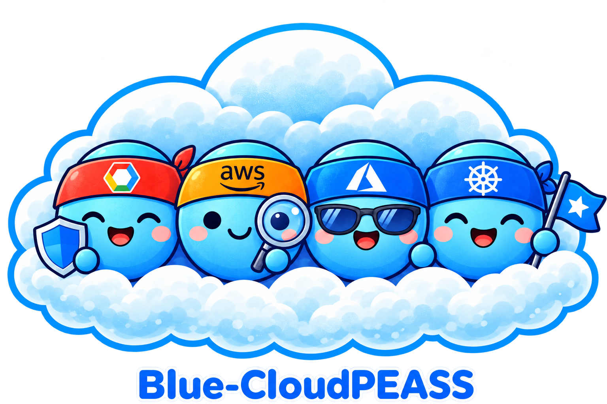

# Blue Cloud PEASS



Blue Cloud PEASS helps blue teams and auditors quickly find risky IAM privileges, unused access, and external trust relationships across AWS, GCP, Azure, and Kubernetes.

## License

Original Blue Cloud PEASS project code is licensed under the **GNU Affero General Public License, version 3 only** (`SPDX-License-Identifier: AGPL-3.0-only`). See [LICENSE](LICENSE) for the full, unchanged license text, matching the AGPL v3 license used by the pinned Steampipe and Powerpipe tools.

Commercial use and paid hosting are permitted under this license, subject to its conditions. Operators of modified versions that users interact with over a network must prominently offer the corresponding source of the running version at no charge as required by section 13, including applicable build and installation scripts. The [source repository](https://github.com/peass-ng/Blue-CloudPEASS) is public; a hosted deployment must provide an appropriate source offer for the version it actually runs.

Third-party dependencies, imported data, and assets retain their respective licenses and notices. In particular, the bundled Turbot provider plugins and compliance/perimeter mods remain Apache-2.0 licensed. This project license grants no rights to third-party trademarks or services and does not resolve Turbot's separate [product terms](https://turbot.com/legal/terms) or [trademark policy](https://turbot.com/legal/trademark) for a commercial hosted deployment.

## What this repo does

- Classifies permissions at runtime using rule files in `risk_rules/`, including AWS, GCP, and Azure permission combinations and Kubernetes context rules synchronized from HackTricks Cloud.
- Produces a **human-readable console report** and an **optional JSON report** (`--out-json <path>`) with a consistent, normalized structure across clouds.
- JSON output includes **permission source attribution** (which role/policy grants each flagged permission) and **group membership expansion** when available.
- Normalized JSON is compacted with **permission/principal/role/group catalogs** so repeated data is referenced by ID.
- Focuses on:
  - **Flagged permissions** (default: `high,critical`)
  - **Inactive principals** (best-effort, provider-dependent)
  - **Unused custom roles/policies**
  - **Keys** (AWS access keys, GCP SA keys)
  - **External trusts** (public access, external identities, cross-account / federation)

Permission levels follow the shared [severity policy](docs/permission-severity-policy.md), with [per-permission source evidence](docs/permission-severity-audit.csv).

## Infrastructure hardening audits

The four scanners also run read-only infrastructure configuration checks using **Steampipe + Powerpipe**. The existing IAM/RBAC audits and authentication options remain available. Hardening runs separately and does not enable cloud APIs, create cloud resources, or apply remediation.

Build the bundled hardening image once. It includes pinned versions of Steampipe, Powerpipe, the AWS/Azure/Entra/GCP/Kubernetes plugins, and the compliance/perimeter mods; no mod downloads or image pulls occur during an audit:

```bash
docker build -f Dockerfile.hardening -t blue-cloudpeass-hardening:local .
python3 -m pip install -r requirements.txt
```

Docker is required **for hardening**, while the existing Python IAM/RBAC audits still work without it. The container runs as your local user, with reduced Linux capabilities, an isolated temporary database, and temporary resolved credentials. Your credential directories and the Docker socket are not mounted into the hardening container. Build the image on the same machine as the Docker daemon: credential mounts require a local Docker daemon.

All scanners accept:

| Option | Behavior |
|---|---|
| `--hardening auto` | Default. Launch all applicable suites when at least one configuration preflight read succeeds. |
| `--hardening on` | Attempt all suites without the preflight gate, useful with restricted audit identities. |
| `--hardening off` | Run only the existing IAM/RBAC audit; make no hardening preflight calls. |
| `--hardening-image IMAGE` | Use a previously built image. Default: `blue-cloudpeass-hardening:local`. |
| `--hardening-timeout SECONDS` | Total time limit per target, including both compliance and perimeter. Default: 1800. |
| `--hardening-out-dir DIRECTORY` | Retain native benchmark exports and a normalized hardening report per target. |
| `--hardening-show-passed` | Also print passed and non-applicable results. All result statuses are retained in JSON regardless. |
| `--hardening-out-markdown PATH` | Write a prepared hardening report as Markdown (`.md` or `.txt`), combining all accounts/projects/subscriptions/clusters in the scan. |
| `--hardening-runtime native` | Use preinstalled Steampipe/Powerpipe in a managed worker image. The default runtime remains Docker. |

Preflight is evidence of some configuration read access, **not proof of complete access**. AWS probes VPC and bucket enumeration; GCP tests instance, bucket, and cluster list permissions; Azure reads resource groups; Kubernetes probes Pods and Services. Empty successful reads also qualify. IAM-only access can still produce the original report. Denied probes, unavailable Docker, missing images, expired tokens, query errors, and timeouts are reported explicitly. A successful command does not imply that every hardening check completed.

Coverage includes the complete `all_controls` catalog for each provider and all top-level perimeter suites for AWS, Azure, and GCP. Running the underlying controls once avoids repeating the same checks across every compliance framework. Findings retain the originating suite, control ID/title/description, upstream severity when supplied, resource, dimensions, status, evidence, and control-reference URL in the console. Severity is `unknown` when upstream supplies none. Findings are not filtered by the IAM `--risk-levels` or truncated by `--max-items`.

Hardening output is organized as **service → finding → assets**. Each control appears once across all scanned targets; every affected asset is listed beneath it with its account/project/cluster, regional or namespace scope, status, and evidence. The Markdown console report uses service headings, finding headings, and asset tables; `--hardening-out-markdown` saves the same prepared report. PASS/SKIP assessments remain in JSON and can also be displayed with `--hardening-show-passed`.

With hardening enabled, `--out-json` uses report schema version 2. Grouped results live at `hardening.services[].findings[].assets[].observations[]`, and target `data.hardening` entries reference their scan and finding IDs. The account/project/cluster scopes remain separate, so identical resource names in different accounts are distinct assets. Different statuses, evidence, regions, and audit identities remain separate observations under the asset. Findings are grouped by provider and full control ID, preserving distinct checks even when their titles match. Execution errors, attempted/empty controls, exclusions, preflight evidence, and mod versions remain available in `hardening.targets` and `hardening.errors`.

`--hardening-out-dir` saves grouped `hardening.json` and `hardening.md` alongside unchanged native benchmark exports. Native exports can contain infrastructure details; retained files use private permissions. Native workers honor `BLUEPEASS_HARDENING_DEADLINE` when a managed execution environment provides a remaining-time budget.

### Known non-actionable findings

[bluepeass/finding_blacklist.yaml](bluepeass/finding_blacklist.yaml) contains the versioned blacklist applied before console, Markdown, and JSON reporting. Rules match a provider and finding section plus explicit resource/identity patterns or control IDs; hardening rules can also limit the matching statuses. Add reviewed edge cases to this file and restart the scanner or rebuild the hosted image to load them.

The [catalog review](docs/hardening-catalog-review.md) and [per-control matrix](docs/hardening-catalog-review.csv) cover all 2,247 definitions in the seven pinned compliance/perimeter mods. The broader blacklist removes invalid assessments and obsolete agent requirements, uses query evidence for resource-specific exceptions, and collapses only identical results from reviewed duplicate queries. `query_context` records the applicability evidence and pinned query corrections used by the runtime. Unknown deployment intent and read failures remain visible.

The initial rules remove inactive/unused cleanup findings for AWS service-linked and Identity Center generated roles, unattached AWS-managed policies, predefined GCP roles, Azure roles explicitly typed `BuiltInRole`, and default Kubernetes system ClusterRoles. The corresponding AWS hardening inactivity checks exclude failed/manual assessments for those provider-managed resources. Customer-defined resources with similar display names remain eligible. Actual role grants and external trusts stay available; execution/query errors remain visible. Rule IDs, reasons, and suppressed record counts appear in `finding_filters`, with a compact console/Markdown explanation. Native benchmark exports remain unfiltered for diagnosis.

### Credentials and scope

- **AWS:** Hardening receives the resolved boto3 session, including explicit access keys/session tokens, selected profiles, default credential-chain identities, and the credentials of each `--assume-roles` target. Every target scans all AWS regions; denied or disabled services remain visible as coverage errors/skips.
- **GCP:** The token selected by the existing service-account JSON, gcloud, or ADC/metadata flow is passed with the selected project and quota project. Organization/all-projects modes audit each enumerated project independently.
- **Azure:** The selected credential object provides ARM and, when available, Graph tokens. Client-secret, device-code, Azure MSAL cache, and direct `--arm-token`/`--graph-token` authentication use the same selected identity. Direct ARM-only credentials continue the subscription audit without directory resolution; unavailable Graph checks appear in coverage. Hardening results remain in JSON even if a subscription's IAM worker fails.
- **Kubernetes:** The already authenticated Python client is materialized into a temporary kubeconfig, supporting kubeconfig/exec helpers, in-cluster credentials, direct bearer tokens, client certificates, and the configured CA/TLS settings. Authentication helpers run on the host. Local API endpoints are reached through `host.docker.internal` while retaining their TLS server name. Snapshot-only `--input-json` analysis never starts a live hardening scan.

AWS and Azure credential files refresh from their selected credential objects during an audit. Explicit temporary credentials still expire at their original expiry. GCP obtains a fresh token from the selected service-account, captured gcloud account/impersonation setting, or ADC credential before hardening starts, and refreshes it between suites. Kubernetes exec/in-cluster token refresh follows the selected Python client's credential hook. Credential expiry is a coverage failure; supplying unrelated default credentials is never a fallback.

Azure `auto` checks whether its cached login can obtain an ARM token before selecting it, and falls back to device-code when no usable login exists. An installed Azure CLI supplies its active account, including encrypted/WAM caches and `AZURE_CONFIG_DIR`; `--tenant-id` is honored, and ARM/Graph acquisitions remain bound to the selected principal. Explicit `--auth-method device-code` and `client-secret` retain their selected authentication mode. Device-code prompts show the verification URL and code using the SDK's three-argument callback. Missing Graph consent/read permissions are reported as incomplete directory coverage after successful ARM authentication, while subscription checks continue. This addresses [Azure authentication issue #4](https://github.com/peass-ng/Blue-CloudPEASS/issues/4).

```bash
# Explicit keys, profiles, and assumed target roles retain their existing meaning.
python3 Blue-AWSPEAS.py --profile auditor --no-access-analyzer --out-json aws-report.json
python3 Blue-AWSPEAS.py --profile auditor --assume-roles arn:aws:iam::111111111111:role/AuditRole --out-json aws-report.json
python3 Blue-GCPPEAS.py --sa-json /path/to/auditor.json --all-projects --quota-project audit-project --out-json gcp-report.json
python3 Blue-AzurePEAS.py --auth-method client-secret --all-subscriptions --out-json azure-report.json
python3 Blue-K8sPEAS.py --context audit-cluster --out-json k8s-report.json
# Retain every native benchmark export, including error/skip details.
python3 Blue-K8sPEAS.py --context audit-cluster --hardening-out-dir ./hardening-exports
```

### Read access to request

Ask the infrastructure owner for a dedicated, time-limited audit identity in **every account, project/subscription, tenant, and cluster in scope**, plus API/VPN connectivity. These recommendations follow HackTricks Cloud's permissions-for-a-pentest pages:

| Platform | Read baseline |
|---|---|
| AWS | `ReadOnlyAccess` in each account, or the narrower `SecurityAudit` with additional service-specific reads as gaps appear. Cross-account scans require `sts:AssumeRole` and trust in each target role. Use existing Access Analyzers with read permissions, or `--no-access-analyzer` for an audit without analyzer creation. |
| GCP | `roles/viewer`, `roles/resourcemanager.folderViewer`, and `roles/resourcemanager.organizationViewer` at the required scopes. Add `roles/iam.securityReviewer` and the existing scanner's Cloud Asset/Recommender/logging read permissions. The owner must enable the APIs required by the services being audited and authorize the quota project. |
| Azure | Azure `Reader` over each subscription and Entra `Global Reader` over each tenant for a user identity. Application identities require the appropriate Microsoft Graph application read permissions and admin consent; ARM Reader alone does not grant Graph access. Narrower `Security Reader` may leave service configuration gaps. |
| Kubernetes | A dedicated identity with `get`, `list`, and `watch` on workloads (including `podtemplates`), RBAC, networking, storage, ConfigMaps, service accounts, quotas, and admission configuration. The built-in `view` role omits RBAC reads. Start with the explicit auditor role from the linked page and add PodTemplate reads required by the bundled mod; `tests/integration/kubernetes-auditor.yaml` provides the tested resource allowlist. Retain the exclusion of Secret values, Pod logs/exec, impersonation, and writes. |

Sources: [AWS permissions](https://cloud.hacktricks.wiki/en/pentesting-cloud/aws-security/aws-permissions-for-a-pentest.html), [GCP permissions](https://cloud.hacktricks.wiki/en/pentesting-cloud/gcp-security/gcp-permissions-for-a-pentest.html), [Azure permissions](https://cloud.hacktricks.wiki/en/pentesting-cloud/azure-security/az-permissions-for-a-pentest.html), [Kubernetes permissions](https://cloud.hacktricks.wiki/en/pentesting-cloud/kubernetes-security/kubernetes-permissions-for-a-pentest.html).

Kubernetes hardening preserves the existing **no Secret-object reads** contract: the upstream Secret namespace check is excluded and appears in coverage. Checks examining Secret references in workload definitions still run. PodSecurityPolicy checks are marked non-applicable on Kubernetes 1.25+ because that API was removed. Host files and hidden managed control-plane settings cannot be assumed audited from API configuration alone. Resource readiness, replica counts, and other operational recommendations are also present in the upstream catalog and should be reviewed in context.

The bundled Kubernetes mod includes a compatibility fix for an upstream `runAsUser` query that otherwise returns a NULL status when both the Pod and container specify UIDs of at least 10000. Removed PodSecurityPolicy admission checks and removed insecure-serving flags are also excluded on server versions where those features no longer exist; the exclusions appear in coverage. There are 742 applicable pinned controls on a Kubernetes 1.25+ cluster.

### Local integration validation

The image has an offline engine/parser fixture that exercises PASS, FAIL, MANUAL, SKIP, and an intentional query error:

```bash
mkdir -p /tmp/bluepeass-smoke
docker run --rm --user "$(id -u):$(id -g)" \
  --mount type=bind,src=/tmp/bluepeass-smoke,dst=/output \
  blue-cloudpeass-hardening:local --self-test --timeout 120
```

For a dedicated local cluster, `tests/integration/kubernetes-hardening.yaml` creates both configurations requiring hardening and hardened counterparts across several workload kinds. `tests/integration/kubernetes-auditor.yaml` adds a read-only service account that has no Secret-object permission. Apply these only to a disposable local cluster, audit that context, and delete the fixtures afterward. `tests/integration/verify_hardening_report.py` verifies the expected catalogs and known Kubernetes findings from private live reports.

## Install

```bash
python3 -m pip install -r requirements.txt
```

The shared categorizations live in `risk_rules/{aws,gcp,azure,k8s}.yaml` and are synchronized weekly from HackTricks Cloud. See [maintaining the shared categorizations](docs/permission-categorization-sync.md). To verify or refresh from a local book checkout:

```bash
python3 scripts/sync_hacktricks_permissions.py --book-root /path/to/hacktricks-cloud --check
python3 scripts/sync_hacktricks_permissions.py --book-root /path/to/hacktricks-cloud
```

Single-permission entries apply immediately. Multi-permission entries become critical or high only when the complete combination is present.

---

<details>
<summary><b>Blue-AWSPEAS.py (AWS)</b></summary>

### Goal
Audit one or more AWS accounts and highlight:
- Principals (users/groups/roles) with flagged permissions
- Unused principals / unused permissions (if Access Analyzer is used)
- Customer-managed IAM policies that are unused
- IAM user access keys (always listed)
- Roles trusting external accounts/providers (best-effort)
- Group memberships (user → group) for relationship graphing

### Techniques used
- IAM enumeration (users, groups, roles, inline + attached policies)
- Policy parsing to compute effective actions (optionally filter to `Resource: *`)
- Permission source attribution per principal (policy/role → flagged permission)
- AWS Access Analyzer (optional) to detect:
  - Unused roles/users/passwords/keys
  - Unused access (unused permissions findings)

### Required permissions (recommended)
For best results, use `ReadOnlyAccess` plus Access Analyzer read access.

**Baseline (minimum-ish):**
- STS identity: `sts:GetCallerIdentity`
- IAM enumeration + policy reads (granular):
  - Principals: `iam:ListUsers`, `iam:ListGroups`, `iam:ListRoles`, `iam:GetGroup`, `iam:ListGroupsForUser`
  - Attached managed policies: `iam:ListAttachedUserPolicies`, `iam:ListAttachedGroupPolicies`, `iam:ListAttachedRolePolicies`
  - Inline policies: `iam:ListUserPolicies`, `iam:ListGroupPolicies`, `iam:ListRolePolicies`, `iam:GetUserPolicy`, `iam:GetGroupPolicy`, `iam:GetRolePolicy`
  - Managed policy documents: `iam:GetPolicy`, `iam:GetPolicyVersion`
  - Customer-managed policy discovery: `iam:ListPolicies`, `iam:GetPolicy`, `iam:GetPolicyVersion`
  - User access keys (always reported): `iam:ListAccessKeys`, `iam:GetAccessKeyLastUsed`

### Minimum permissions & setup (AWS CLI)
Example of creating an IAM user with the minimal permissions to run Blue-AWSPEAS (includes Access Analyzer):

```bash
USER_NAME="blue-cloudpeass-auditor"

aws iam create-user --user-name "${USER_NAME}"

cat > /tmp/blue-aws-min.json <<'JSON'
{
  "Version": "2012-10-17",
  "Statement": [
    {
      "Sid": "BlueAwsPeassRead",
      "Effect": "Allow",
      "Action": [
        "sts:GetCallerIdentity",
        "iam:ListUsers",
        "iam:ListGroups",
        "iam:ListRoles",
        "iam:GetGroup",
        "iam:ListGroupsForUser",
        "iam:ListAttachedUserPolicies",
        "iam:ListAttachedGroupPolicies",
        "iam:ListAttachedRolePolicies",
        "iam:ListUserPolicies",
        "iam:ListGroupPolicies",
        "iam:ListRolePolicies",
        "iam:GetUserPolicy",
        "iam:GetGroupPolicy",
        "iam:GetRolePolicy",
        "iam:ListPolicies",
        "iam:GetPolicy",
        "iam:GetPolicyVersion",
        "iam:ListAccessKeys",
        "iam:GetAccessKeyLastUsed",
        "access-analyzer:List*",
        "access-analyzer:Get*",
        "access-analyzer:CreateAnalyzer",
        "access-analyzer:DeleteAnalyzer",
        "iam:CreateServiceLinkedRole"
      ],
      "Resource": "*"
    }
  ]
}
JSON

aws iam put-user-policy \
  --user-name "${USER_NAME}" \
  --policy-name "BlueAwsPeassMin" \
  --policy-document file:///tmp/blue-aws-min.json

# Create access key for the user
aws iam create-access-key --user-name "${USER_NAME}"
```

If you do not want Access Analyzer, remove the `access-analyzer:*` permissions and `iam:CreateServiceLinkedRole` from the policy.

**If you use `--assume-roles`:**
- `sts:AssumeRole` on the target role ARNs

**If using Access Analyzer (recommended):**
- If analyzers already exist: `AWSAccessAnalyzerReadOnlyAccess`
- If the tool must create/delete analyzers:
  - `access-analyzer:CreateAnalyzer`, `access-analyzer:DeleteAnalyzer`, `access-analyzer:List*`, `access-analyzer:Get*`
  - `iam:CreateServiceLinkedRole` (for `access-analyzer.amazonaws.com`)

### Help
```bash
python3 Blue-AWSPEAS.py --help
```

**Help output**
```text
usage: Blue-AWSPEAS.py [-h] [--profile PROFILE] [-v] [--no-access-analyzer]
                       [--only-all-resources] [--risk-levels RISK_LEVELS]
                       [--max-perms-to-print MAX_PERMS_TO_PRINT]
                       [--min-unused-days MIN_UNUSED_DAYS]
                       [--out-json OUT_JSON]
                       [--max-parallel-accounts MAX_PARALLEL_ACCOUNTS]
                       [--access-key-id ACCESS_KEY_ID]
                       [--secret-access-key SECRET_ACCESS_KEY]
                       [--session-token SESSION_TOKEN]
                       [--assume-roles ASSUME_ROLES [ASSUME_ROLES ...]]

Find AWS unused principals and permissions in one or several AWS accounts.

optional arguments:
  -h, --help            show this help message and exit
  --profile PROFILE     AWS profile to check
  -v, --verbose         Get info about why a permission is sensitive or useful
                        for privilege escalation.
  --no-access-analyzer  Disable AWS Access Analyzer (will not report unused
                        resources/permissions, but will still list all
                        principals and their sensitive permissions)
  --only-all-resources  Only consider permissions that apply to `Resource: *`
                        (filters out resource-scoped statements).
  --risk-levels RISK_LEVELS
                        Comma-separated list of risk levels to flag
                        (low,medium,high,critical). Default: high,critical
  --max-perms-to-print MAX_PERMS_TO_PRINT
                        Maximum number of permissions to print per row
  --min-unused-days MIN_UNUSED_DAYS
                        Minimum number of days a resource must be unused to be
                        reported (default: 90)
  --out-json OUT_JSON   Write full JSON results to this path (stdout stays
                        human-readable).
  --max-parallel-accounts MAX_PARALLEL_ACCOUNTS
                        Max accounts to analyze in parallel when multiple
                        accounts are targeted (default: 10).
  --access-key-id ACCESS_KEY_ID
                        AWS Access Key ID (alternative to profile)
  --secret-access-key SECRET_ACCESS_KEY
                        AWS Secret Access Key (required with --access-key-id)
  --session-token SESSION_TOKEN
                        AWS Session Token (optional, for temporary
                        credentials)
  --assume-roles ASSUME_ROLES [ASSUME_ROLES ...]
                        List of role ARNs to assume for multi-account analysis
                        (space- or comma-separated)
```

### Examples
```bash
# Single account
python3 Blue-AWSPEAS.py --profile myprofile

# Disable Access Analyzer (still lists principals + flagged permissions)
python3 Blue-AWSPEAS.py --profile myprofile --no-access-analyzer

# Only consider actions granted with Resource:"*"
python3 Blue-AWSPEAS.py --profile myprofile --only-all-resources

# Multi-account via AssumeRole (parallel by default)
python3 Blue-AWSPEAS.py --profile myprofile --assume-roles arn:aws:iam::111111111111:role/AuditRole arn:aws:iam::222222222222:role/AuditRole

# Control account parallelism (default: 10)
python3 Blue-AWSPEAS.py --profile myprofile --assume-roles arn:aws:iam::111111111111:role/AuditRole --max-parallel-accounts 5

# JSON output
python3 Blue-AWSPEAS.py --profile myprofile --out-json /tmp/aws.json
```

</details>

---

<details>
<summary><b>Blue-GCPPEAS.py (GCP)</b></summary>

### Goal
Audit one or more GCP projects (or an organization) and highlight:
- Principals with flagged effective permissions (role expansion)
- External/public trusts (public members, external email domains, cross-project SAs, Workload Identity/Federation)
- Inactive principals and inactive service account keys (best-effort via Cloud Logging)
- Unused custom roles (best-effort)

### Techniques used
- IAM policy fetch at project/org scope
- Cloud Asset Inventory for:
  - Resource IAM across the project (enabled by default; can be disabled)
  - External trust discovery (WIF, domain principals, cross-project SAs, public access)
- Recommender API for IAM least-privilege recommendations
- IAM insights are also used to mark `reported unused` permissions in principal risk output (`Critical/High & reported unused`).
  This is best-effort and only appears when insight payloads include permission-level detail.
- Cloud Logging (Audit Logs) best-effort for activity checks
- Cloud Identity group membership expansion (optional, best-effort)

### Required APIs
Typically needed (depending on flags):
- Cloud Asset Inventory
- Recommender
- Cloud Logging
- Cloud Resource Manager
- IAM
- Cloud Identity (only if you want group membership expansion for `group:` principals)
- Service Usage (only to enable missing APIs; best-effort, done via `gcloud services enable` when needed)

### Required permissions (recommended)
Use a dedicated auditor identity with read-only roles that cover:
- IAM policy reads + role reads
- Cloud Asset IAM search
- Recommender read
- Logging read

**Granular permissions (what the tool actually calls):**
- Project/org IAM policy:
  - `resourcemanager.projects.getIamPolicy`
  - `resourcemanager.organizations.getIamPolicy` (when `--organization`)
  - `resourcemanager.folders.getIamPolicy` + `resourcemanager.projects.getAncestry` (folder inheritance scan)
- Project enumeration (when `--all-projects`): `resourcemanager.projects.list`
- Recommender:
  - `recommender.locations.list`
  - `recommender.iamPolicyRecommendations.list`
  - `recommender.iamPolicyChangeRiskRecommendations.list`
  - `recommender.iamServiceAccountChangeRiskRecommendations.list`
- Cloud Asset (resource IAM scan is enabled by default):
  - `cloudasset.assets.searchAllIamPolicies`
- Role expansion:
  - `iam.roles.get` (predefined + custom roles)
  - `iam.roles.list` (custom roles discovery)
- Service account keys:
  - `iam.serviceAccountKeys.list` (user-managed keys)
- Group membership expansion (optional):
  - `cloudidentity.groups.get`
  - `cloudidentity.groups.list`
  - `cloudidentity.groups.memberships.list`
- Audit logs activity checks (best-effort):
  - `logging.logEntries.list`
- Enabling missing APIs (only if not enabled; quota project only):
  - `serviceusage.services.use`
  - `serviceusage.services.get`
  - `serviceusage.services.list`
  - `serviceusage.services.enable`

Common built-in roles that usually work:
- `roles/viewer`
- `roles/iam.securityReviewer` and/or `roles/iam.roleViewer`
- `roles/cloudasset.viewer`
- `roles/recommender.iamViewer`
- `roles/logging.viewer`
- If you want group membership expansion (Cloud Identity): a role that grants the above Cloud Identity permissions (e.g., a custom role or the Cloud Identity groups/memberships read-only roles in your org).
- If you want the tool to auto-enable missing APIs: `roles/serviceusage.serviceUsageAdmin` on the quota project (or pre-enable APIs).

### Common pitfalls
- For full coverage, prefer `--organization`. `--all-projects` may return zero projects for a service account without org-level visibility.
- Recommender requires `recommender.googleapis.com` enabled per project; the tool will try to enable it if it has Service Usage permissions.
- Use a quota project with billing enabled (or pass `--quota-project`) for Cloud Asset/Recommender APIs.

### Quick setup (service account with minimal permissions)
```bash
# Set these values
ORG_ID="1234567890"
PROJECT_ID="my-project"

# Create service account
gcloud iam service-accounts create blue-cloudpeass-auditor \
  --display-name="Blue CloudPEASS Auditor" \
  --project "$PROJECT_ID"

# Create org-level custom role with minimal permissions
gcloud iam roles create blueCloudpeassAuditor \
  --organization "$ORG_ID" \
  --title="Blue CloudPEASS Auditor" \
  --description="Least-privilege permissions for Blue-GCPPEAS" \
  --stage=GA \
  --permissions="resourcemanager.projects.get,resourcemanager.projects.list,resourcemanager.projects.getIamPolicy,resourcemanager.organizations.get,resourcemanager.organizations.getIamPolicy,resourcemanager.folders.getIamPolicy,iam.roles.get,iam.roles.list,iam.serviceAccountKeys.list,cloudasset.assets.searchAllIamPolicies,logging.logEntries.list,recommender.locations.list,recommender.iamPolicyRecommendations.list,recommender.iamPolicyChangeRiskRecommendations.list,recommender.iamServiceAccountChangeRiskRecommendations.list,serviceusage.services.use,serviceusage.services.get,serviceusage.services.list,serviceusage.services.enable"

# Grant the org role to the SA
gcloud organizations add-iam-policy-binding "$ORG_ID" \
  --member="serviceAccount:blue-cloudpeass-auditor@${PROJECT_ID}.iam.gserviceaccount.com" \
  --role="organizations/${ORG_ID}/roles/blueCloudpeassAuditor"

# Create key file
gcloud iam service-accounts keys create ./blue-cloudpeass-key.json \
  --iam-account="blue-cloudpeass-auditor@${PROJECT_ID}.iam.gserviceaccount.com"
```

### Help
```bash
python3 Blue-GCPPEAS.py --help
```

**Help output**
```text
usage: Blue-GCPPEAS.py [-h]
                       [--project PROJECT | --organization ORGANIZATION | --all-projects]
                       [--sa-json SA_JSON] [--quota-project QUOTA_PROJECT]
                       [--page-size PAGE_SIZE] [--max-items MAX_ITEMS]
                       [--out-json OUT_JSON]
                       [--max-parallel-scopes MAX_PARALLEL_SCOPES]
                       [--min-unused-days MIN_UNUSED_DAYS]
                       [--risk-levels RISK_LEVELS]
                       [--include-folder-inheritance]
                       [--no-include-folder-inheritance]
                       [--no-scan-resource-iam]
                       [--skip-workload-identity-scan]
                       [--allowed-domain ALLOWED_DOMAIN]
                       [--skip-external-domain-scan]
                       [--allowed-project ALLOWED_PROJECT]
                       [--skip-external-trust-scan]

Find GCP IAM least-privilege opportunities using Recommender + Cloud Asset
Inventory (uses your current gcloud login).

optional arguments:
  -h, --help            show this help message and exit
  --project PROJECT     Project ID to analyze (repeatable).
  --organization ORGANIZATION
                        Organization ID to analyze (e.g., 1234567890).
  --all-projects        Enumerate and analyze all accessible projects.
  --sa-json SA_JSON     Service Account JSON credentials (path to key file or
                        raw JSON string). If omitted, uses gcloud creds or
                        ADC/metadata.
  --quota-project QUOTA_PROJECT
                        Project ID used for API quota/billing (X-Goog-User-
                        Project). Defaults to the first analyzed project.
  --page-size PAGE_SIZE
                        Page size for API list calls (default: 200).
  --max-items MAX_ITEMS
                        Max findings to print per section (default: 20).
  --out-json OUT_JSON   Write full JSON results to this path (stdout stays
                        human-readable).
  --max-parallel-scopes MAX_PARALLEL_SCOPES
                        Max projects/scopes to analyze in parallel (default:
                        10).
  --min-unused-days MIN_UNUSED_DAYS
                        Days without observed audit-log activity to consider
                        inactive (default: 90).
  --risk-levels RISK_LEVELS
                        Comma-separated list of risk levels to flag
                        (low,medium,high,critical). Default: high,critical
  --include-folder-inheritance
                        Include IAM bindings inherited from ancestor folders
                        (default: enabled).
  --no-include-folder-inheritance
                        Disable folder inheritance scan.
  --no-scan-resource-iam
                        Disable scanning IAM bindings on resources inside the
                        project (Cloud Asset Inventory).
  --skip-workload-identity-scan
                        Skip Cloud Asset scan for Workload Identity
                        Pool/Federation trust principals.
  --allowed-domain ALLOWED_DOMAIN
                        Allowed identity domain(s) (repeatable). Used to flag
                        email/domain principals outside this allowlist.
  --skip-external-domain-scan
                        Skip Cloud Asset scan for `domain:<domain>` principals
                        (only runs when --allowed-domain is set).
  --allowed-project ALLOWED_PROJECT
                        Allowed project ID(s) for cross-project serviceAccount
                        members (repeatable).
  --skip-external-trust-scan
                        Skip external trust scan (public, cross-project
                        service accounts, workload identity federation,
                        external domains).
```

### Examples
```bash
# Current gcloud default project
python3 Blue-GCPPEAS.py

# One or more projects
python3 Blue-GCPPEAS.py --project my-project-1 --project my-project-2

# Whole org (use a quota project for billing/quota)
python3 Blue-GCPPEAS.py --organization 1234567890 --quota-project my-billing-project

# Disable resource-level IAM scan (default is enabled)
python3 Blue-GCPPEAS.py --project my-project --no-scan-resource-iam

# Control project parallelism (default: 10)
python3 Blue-GCPPEAS.py --all-projects --max-parallel-scopes 10

# JSON output
python3 Blue-GCPPEAS.py --project my-project --out-json /tmp/gcp.json
```

</details>

---

<details>
<summary><b>Blue-AzurePEAS.py (Azure)</b></summary>

### Goal
Audit one or more Azure subscriptions (or all accessible subscriptions) and highlight:
- Principals with flagged RBAC permissions (role definition action patterns classified by risk rules)
- Inactive principals (best-effort; Activity Logs + Entra sign-in activity when available)
- Unused custom roles (subscription + resource-group scopes)
- External trusts:
  - Foreign principals in RBAC assignments
  - Guest users (tenant-wide) and whether they have RBAC in the subscription
  - Managed identity federated credentials (OIDC trust)
- Optional: management group custom roles when scanning all subscriptions

### Techniques used
- Azure Resource Manager RBAC:
  - Role assignments + role definitions
  - Custom roles at subscription and resource-group scopes
- Azure Activity Logs (best-effort “used recently” signals; not equivalent to AWS Access Analyzer)
- Microsoft Graph (best-effort):
  - Resolve objectIds to UPN/mail/display name (enabled by default)
  - User sign-in activity (`signInActivity`) when available (v1.0 or beta fallback)
  - Guest user enumeration
  - Group membership expansion (transitive) for group-linked principals (when Graph allows it)
- Managed identity federated credential discovery via ARM resource listing

### Authentication
No `az` subprocess calls. The tool supports:
- Azure CLI token cache (default auto): reads `~/.azure/msal_token_cache.json`; if silent cache acquisition is unavailable, uses the installed `az` CLI through `AzureCliCredential`. The selected tenant/principal is pinned across token audiences. Other authentication methods do not require Azure CLI.
- Device code auth:
  - `--auth-method device-code`
- Service principal (client secret):
  - `--auth-method client-secret --tenant-id ... --client-id ... --client-secret ...`
  - Or set `AZURE_TENANT_ID`, `AZURE_CLIENT_ID`, `AZURE_CLIENT_SECRET`

### Required permissions (recommended)
For subscription RBAC + resources read:
- RBAC:
  - `Microsoft.Authorization/roleAssignments/read`
  - `Microsoft.Authorization/roleDefinitions/read`
- Resource group enumeration (to find RG-scoped custom roles):
  - `Microsoft.Resources/subscriptions/resourceGroups/read`
- Resource listing (to find MI federated credentials):
  - `Microsoft.Resources/resources/read`

For Activity Logs:
- `Microsoft.Insights/eventtypes/values/read`

For management group custom roles (when `--all-subscriptions` + management group scan):
- `Microsoft.Management/managementGroups/read`
- `Microsoft.Authorization/roleDefinitions/read` on the management group scope

For Graph-based resolution (recommended for readable output):
- Delegated/app Graph permissions vary by tenant, but commonly needed:
  - `Directory.Read.All`
  - `User.Read.All`
  - `AuditLog.Read.All` (for sign-in activity in many tenants; tool attempts `signInActivity` via v1.0 and beta)
  - `Group.Read.All` or `GroupMember.Read.All` (for group membership expansion)
If these aren’t granted, the tool will still run but may fall back to object IDs for some principals.

### Minimum permissions & setup (Azure CLI)
Below is an end-to-end setup that creates a service principal, assigns the RBAC roles at the management-group scope (so all subscriptions inherit), and grants the Microsoft Graph app roles needed for identity resolution.

```bash
APP_NAME="blue-cloudpeass-auditor"
MG_ID="your-management-group-id"
SCOPE="/providers/Microsoft.Management/managementGroups/${MG_ID}"

# Create the SP without RBAC assignments.
az ad sp create-for-rbac --name "${APP_NAME}" --skip-assignment --sdk-auth > /tmp/blue-azure-sp.json

# Fetch the appId for role assignments.
APP_ID=$(az ad sp list --display-name "${APP_NAME}" --query "[0].appId" -o tsv)

# RBAC roles at the management group scope (inherit to all subscriptions).
az role assignment create --assignee "${APP_ID}" --role "Reader" --scope "${SCOPE}"
az role assignment create --assignee "${APP_ID}" --role "Monitoring Reader" --scope "${SCOPE}"
az role assignment create --assignee "${APP_ID}" --role "Management Group Reader" --scope "${SCOPE}"

# Microsoft Graph app roles (admin consent required).
GRAPH_APP_ID="00000003-0000-0000-c000-000000000000"
az ad app permission add --id "${APP_ID}" --api "${GRAPH_APP_ID}" --api-permissions \
  7ab1d382-f21e-4acd-a863-ba3e13f7da61=Role \
  df021288-bdef-4463-88db-98f22de89214=Role \
  b0afded3-3588-46d8-8b3d-9842eff778da=Role \
  5b567255-7703-4780-807c-7be8301ae99b=Role \
  98830695-27a2-44f7-8c18-0c3ebc9698f6=Role
az ad app permission admin-consent --id "${APP_ID}"
```

Notes:
- If you scan only specific subscriptions, you can assign the RBAC roles at subscription scope instead of the management group.
- If you don’t want Graph resolution/guest scanning, run with `--no-resolve-principals --no-scan-entra` and skip the Graph app roles.

### Help
```bash
python3 Blue-AzurePEAS.py --help
```

**Help output**
```text
usage: Blue-AzurePEAS.py [-h]
                         (--subscription SUBSCRIPTION | --all-subscriptions)
                         [--risk-levels RISK_LEVELS]
                         [--min-unused-days MIN_UNUSED_DAYS]
                         [--max-items MAX_ITEMS]
                         [--activity-max-events ACTIVITY_MAX_EVENTS]
                         [--skip-activity-logs] [--no-resolve-principals]
                         [--scan-entra] [--no-scan-entra]
                         [--scan-mi-federation] [--no-scan-mi-federation]
                         [--max-entra-items MAX_ENTRA_ITEMS]
                         [--scan-management-groups]
                         [--no-scan-management-groups]
                         [--max-parallel-subscriptions MAX_PARALLEL_SUBSCRIPTIONS]
                         [--auth-method AUTH_METHOD] [--tenant-id TENANT_ID]
                         [--client-id CLIENT_ID]
                         [--client-secret CLIENT_SECRET]
                         [--device-client-id DEVICE_CLIENT_ID]
                         [--no-az-token-cache] [--out-json OUT_JSON]

Find Azure RBAC risky permissions and inactive principals (best-effort). Uses
Azure SDKs and HTTP APIs; cache authentication can use the host `az` helper.

optional arguments:
  -h, --help            show this help message and exit
  --subscription SUBSCRIPTION
                        Subscription ID or name to analyze (repeatable).
  --all-subscriptions   Enumerate and analyze all accessible subscriptions.
  --risk-levels RISK_LEVELS
                        Comma-separated list of risk levels to flag
                        (low,medium,high,critical). Default: high,critical
  --min-unused-days MIN_UNUSED_DAYS
                        Days without observed Activity Log events to consider
                        inactive (default: 90).
  --max-items MAX_ITEMS
                        Max findings to print per section (default: 20).
  --activity-max-events ACTIVITY_MAX_EVENTS
                        Max Activity Log events to fetch per subscription
                        (default: 20000).
  --skip-activity-logs  Skip Activity Log scan (disables inactive and last-
                        used heuristics).
  --no-resolve-principals
                        Disable Microsoft Graph principal resolution.
  --scan-entra          Scan Entra ID for guest users (best-effort; default:
                        enabled).
  --no-scan-entra       Disable Entra ID guest user scan.
  --scan-mi-federation  Scan subscription for managed identity federated
                        credentials (best-effort; default: enabled).
  --no-scan-mi-federation
                        Disable MI federated-credential scan.
  --max-entra-items MAX_ENTRA_ITEMS
                        Cap results for Entra/MI scans (default: 2000).
  --scan-management-groups
                        When using --all-subscriptions, also scan management
                        groups for unused custom roles (best-effort; default:
                        enabled).
  --no-scan-management-groups
                        Disable management group scan.
  --max-parallel-subscriptions MAX_PARALLEL_SUBSCRIPTIONS
                        Max subscriptions to analyze in parallel (default:
                        10).
  --auth-method AUTH_METHOD
                        Authentication method: auto, client-secret, device-
                        code, az-cache (default: auto).
  --tenant-id TENANT_ID
                        Tenant ID (required for client-secret auth; optional
                        for device-code).
  --client-id CLIENT_ID
                        Service principal (app) client ID for client-secret
                        auth.
  --client-secret CLIENT_SECRET
                        Service principal client secret for client-secret
                        auth.
  --device-client-id DEVICE_CLIENT_ID
                        Public client ID for device-code auth (default: Azure
                        CLI public app id).
  --no-az-token-cache   Do not read tokens from
                        ~/.azure/msal_token_cache.json; force device-
                        code/client-secret auth.
  --out-json OUT_JSON   Write full JSON results to this path (stdout stays
                        human-readable).
```

### Examples
```bash
# Current subscription
python3 Blue-AzurePEAS.py --subscription <SUBSCRIPTION_ID_OR_NAME>

# All subscriptions (parallel by default)
python3 Blue-AzurePEAS.py --all-subscriptions

# Control subscription parallelism (default: 10)
python3 Blue-AzurePEAS.py --all-subscriptions --max-parallel-subscriptions 10

# Disable Graph resolution (not recommended)
python3 Blue-AzurePEAS.py --subscription <SUB> --no-resolve-principals

# JSON output
python3 Blue-AzurePEAS.py --subscription <SUB> --out-json /tmp/azure.json
```

</details>

---

<details>
<summary><b>Blue-K8sPEAS.py (Kubernetes)</b></summary>

Read-only RBAC and service-account audit using direct Kubernetes API calls through the Python client. It uses the current kubeconfig context by default, accepts `--kubeconfig` and `--context`, and supports in-cluster credentials or `--server` with `--token-file`. **`kubectl` is not required.** A kubeconfig that specifies an `exec` credential plugin can still invoke that configured authentication helper; use in-cluster credentials or a token file to avoid external executables entirely. The scan lists Roles, ClusterRoles, their bindings, service accounts, and workloads. It **never lists Secret objects**; it analyzes RBAC rules granting access to Secrets without reading the Secrets themselves. Service accounts also inherit grants to `system:serviceaccounts`, their namespace group, and `system:authenticated`. Namespace-scoped RoleBindings remain scoped to their namespace.

It flags sensitive grants (wildcards, RBAC changes, impersonation, Secret access, token creation, pod execution and workload modification), broad or anonymous bindings, cloud workload identity annotations, workloads running with flagged service accounts, and principals that can create workloads using a flagged service account in the same namespace. It also reports custom role definitions with no bindings, service accounts with no listed workloads, and dangling role references. The JSON report includes all declared grants, role definitions, source attribution, inventory, and coverage errors in the shared catalog-based report format.

```bash
python3 Blue-K8sPEAS.py --context minikube --out-json k8s-report.json
python3 Blue-K8sPEAS.py --server https://k8s.example:6443 --token-file ./token --ca-cert ./ca.crt
python3 Blue-K8sPEAS.py --in-cluster --out-json k8s-report.json
python3 Blue-K8sPEAS.py --risk-levels medium,high,critical --max-items 30
python3 Blue-K8sPEAS.py --audit-log /path/to/kube-audit.jsonl --min-unused-days 90 --out-json k8s-report.json
```

The scanner needs `list` access to `roles`, `clusterroles`, `rolebindings`, and `clusterrolebindings` for core RBAC analysis. For all checks, it also needs `list` access to `serviceaccounts`, `pods`, `deployments`, `daemonsets`, `statefulsets`, `jobs`, and `cronjobs` across namespaces. It does not need permission to list or get Secrets. Each resource is fetched separately; denied reads appear in report coverage. A missing binding list disables unused-role conclusions, and a missing workload list disables service-account workload-reference conclusions. The command returns exit code 1 when any core RBAC list is missing.

Kubernetes RBAC has no per-permission last-used API. With `--audit-log`, the tool reports grants and principals **not observed** in the supplied JSON-lines audit events during the lookback window. This is a lead for review, not proof of unused access: audit policy, retention, gaps, and other authorizers affect what appears in the log. An unbound role is unused *as an RBAC grant*, while a service account without a listed workload can still be used externally. RBAC grants are declared permissions, not a live authorization decision: other authorizers, admission, and resource-specific constraints may also apply. API discovery identifies cluster-scoped resources, including custom resources, so ordinary cluster-resource rules are excluded from namespaced RoleBinding grants; the scanner uses a built-in resource list if discovery fails. Group membership outside the built-in service-account groups cannot be resolved from the Kubernetes API.

The scope and activity checks follow the Kubernetes [RBAC reference](https://kubernetes.io/docs/reference/access-authn-authz/rbac/) and [API discovery](https://kubernetes.io/docs/reference/using-api/api-concepts/).

</details>
